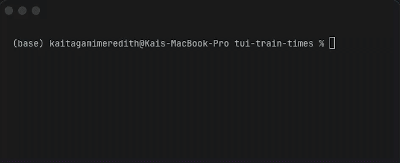

# tui-train-times


Terminal countdown clock for NYC MTA subway arrivals. Modeled after the platform screens.

---



---

## Setup

```bash
pip install nyct-gtfs rich
pip install pynput
```

Place `traintime.py` and `stations.json` in the same directory.

## Usage

```bash
python3 traintime.py
```

Type part of a station name, select from results, optionally filter by line. The clock launches and polls live MTA data every 30 seconds.

## Data

`stations.json` is generated from the GTFS static feed bundled with `nyct-gtfs`. To regenerate it:

```bash
python3 generate_stations.py
```

Covers all 499 NYC subway stations. Bullet colors use official MTA brand hex values.

## Stack

- [`nyct-gtfs`](https://github.com/Andrew-Dickinson/nyct-gtfs) for real-time feed parsing
- [`rich`](https://github.com/Textualize/rich) for terminal rendering